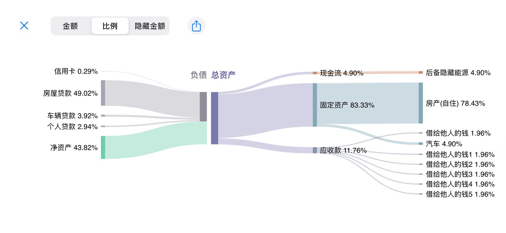
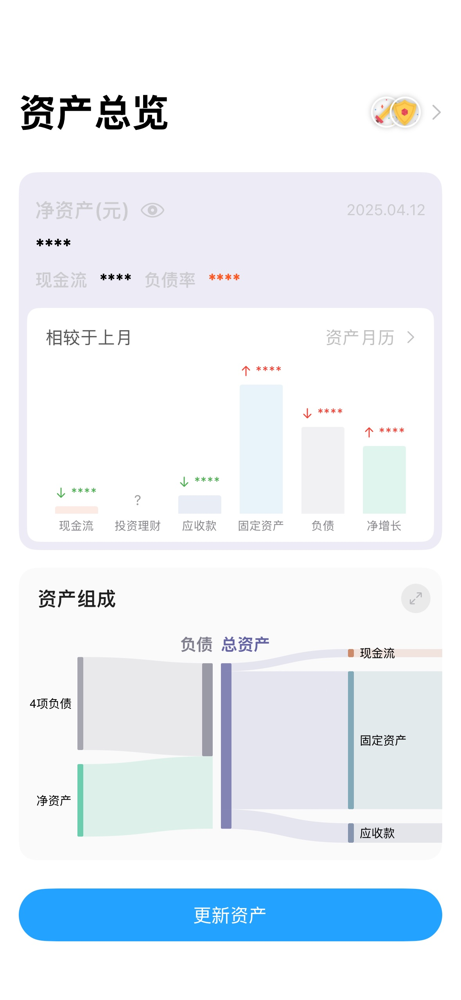
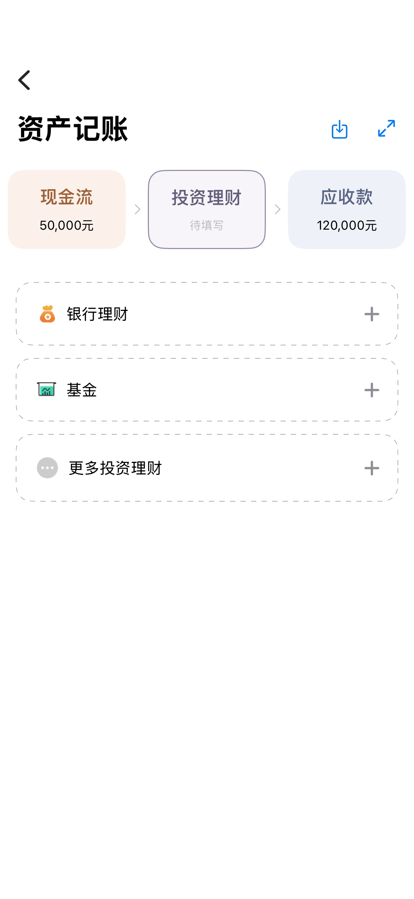
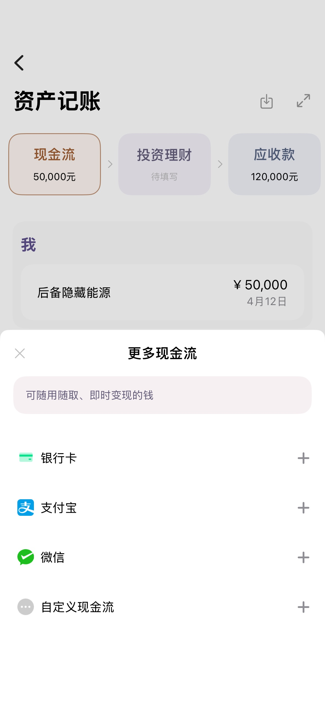
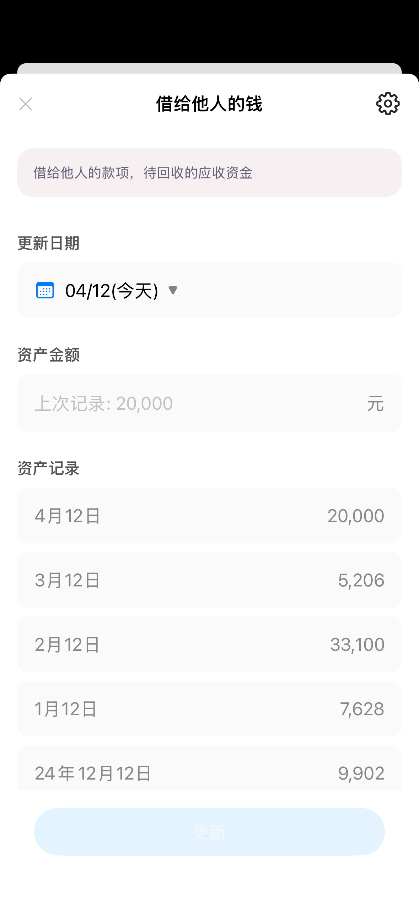
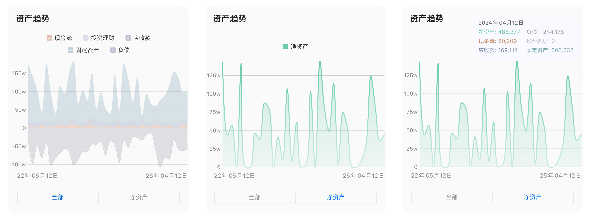

## Core

可视化资金状况，洞察发展趋势 

#### 核心指标

现金流、净资产、负债率、月度增减

---

## Changelog

- [x] 桑基图
    - [x] 全屏模式
    - [x] 完全离线
    - [ ] 可定制化
- [x] 资产登记
- [x] 资产变更日志
- [x] 总览视图: 现金流、净资产、负债率、月度增减
- [x] 资产月历
- [x] 资产趋势
- [x] 数据导出
- [ ] 数据导入

## Screenshot

 

